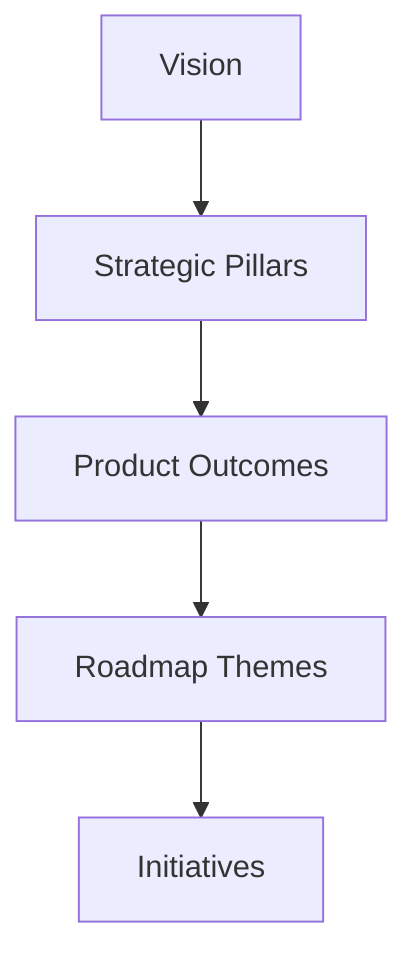

## The Strategy Cascade

OpenBacklog uses a proven framework to connect long-term vision to near-term execution. Each layer answers a different question — from *why you exist* to *what you do next*.



| Level | Time Horizon | Core Question |
|-------|--------------|---------------|
| **Vision** | 5-10 years | *Why do we exist and what future are we trying to create?* |
| **Strategic Pillars** | 2-4 years | *What enduring ways will we win?* |
| **Product Outcomes** | 1-3 years | *What measurable progress shows we're succeeding?* |
| **Roadmap Themes** | 6-12 months | *What bets or problem spaces will move those outcomes?* |
| **Initiatives** | 0-6 months | *What specific projects will deliver the themes?* |

<Note>
**Progressive disclosure:** You don't need to define everything upfront. Start with a vision and initiatives, then add pillars, outcomes, and themes as your strategy matures.
</Note>

---

## Vision

Your vision describes the **change you want to make in the world** — not what you're building, but why it matters.

<Tip>
**The Vision Test:** "If others achieve this vision and we can close shop, it's a good one." This ensures your vision is world-centric rather than self-serving.
</Tip>

**Good visions are:**
- Aspirational and long-term (5-10 years)
- About outcomes for users, not company goals
- Durable — they stay valid as strategies evolve

| Weak Vision | Strong Vision |
|-------------|---------------|
| "Be the market leader in AI project management." | "Make AI-assisted product development accessible to every solo developer." |
| "Scale to 1M users." | "Make solo developers as productive as 10-person teams." |

---

## Strategic Pillars

Strategic pillars are **enduring, guiding choices** that define how you'll achieve your vision. They're the scaffolding of your strategy — each one describes a long-term "way of competing."

<Tip>
**Pillars express advantage, not activity.** They explain *how* you'll differentiate, not *what* you're doing this quarter.
</Tip>

**Good pillars are:**
- **Durable** — Last for years, not tied to a specific initiative
- **Differentiating** — Capture a way of winning distinct from competitors
- **Actionable** — Guide trade-offs and decision-making
- **Limited** — 3-5 pillars maximum

| Bad Pillar | Good Pillar |
|------------|-------------|
| "Launch mobile app" (too tactical) | "Seamless Developer Flow" |
| "Innovation" (too generic) | "AI-Native Guidance" |
| "Engineering Quality" (departmental) | "Radical Simplicity" |

### Using Pillars for Decisions

Pillars create consistency across decisions. When facing a trade-off, use them like a compass:

| Decision | Guided By |
|----------|-----------|
| "Should we add collaboration features?" | No — violates "Solo developer focus" |
| "Should we delay a feature to make it faster?" | Yes — aligns with "Radical Simplicity" |

---

## Product Outcomes

Product outcomes describe **observable, measurable changes** in user behavior that indicate progress toward your vision.

<Tip>
**Good outcomes measure behavior, not activity.** They show that users are succeeding, not that the team is busy.
</Tip>

**Good outcomes are:**
- **User-behavior focused** — What users *do*, not what you *build*
- **Measurable** — Track progress objectively
- **Rooted in pillars** — Evidence that a pillar is working
- **Time-bound** — Framed within a 1-3 year horizon

| Bad Outcome | Good Outcome |
|-------------|--------------|
| "Launch AI assistant" (output) | "80% of users create tasks using AI weekly" |
| "Improve user experience" (vague) | "Median task creation under 10 seconds" |
| "Increase logins" (vanity metric) | "50% of commits reference an OpenBacklog task" |

### Outcome Structure

Use this formula to craft outcomes:

> **[User segment] [does X or experiences Y] resulting in [measurable signal].**

Examples:
- "Solo developers complete end-to-end releases twice as fast."
- "New users reach their first AI-assisted task within 5 minutes."
- "Active users maintain 90-day streaks of backlog updates."

---

## Roadmap Themes

Roadmap themes are **strategic bet areas** that organize your roadmap around problems to solve, not features to build.

<Tip>
**Good themes express intent and learning focus.** They communicate *what you're exploring and why*, not *what you're building and when*.
</Tip>

**Good themes are:**
- **Problem-oriented** — Describe a user problem, not features
- **Outcome-aligned** — Ladder up to product outcomes
- **Exploratory** — Include discovery and learning goals
- **Communicable** — Clear, memorable phrases

| Bad Theme | Good Theme |
|-----------|------------|
| "AI Assistant v2" (feature list) | "AI as Co-Pilot" |
| "Infrastructure" (departmental) | "Stay in Flow" |
| "Add dark mode" (too narrow) | "Zero Friction" |

### Theme Anatomy

Each theme should articulate:

| Element | Question | Example |
|---------|----------|---------|
| **Name** | What's the shorthand? | "Stay in Flow" |
| **Problem** | What are we solving? | "Devs lose focus context switching" |
| **Hypothesis** | What's our bet? | "IDE integration increases task completion" |
| **Outcomes** | Which outcomes does this advance? | "70% manage backlog from IDE" |
| **Metrics** | How do we measure success? | "IDE engagement, completion velocity" |

---

## Working with AI

When connected via MCP, your AI assistant helps you build and refine your strategy:

```text
"What's my product vision?"
"Help me define strategic pillars for my project"
"Create an outcome for user retention"
"What themes should I focus on this quarter?"
"Show me how my initiatives connect to the vision"
```

The AI can also generate a **"Previously On..."** narrative recap that summarizes your strategic progress in story form.

---

## Traceability

The power of the cascade is **traceability** — every piece of work connects back to the vision:

```
Task: "Add keyboard shortcuts for task creation"
  ↑ belongs to
Initiative: "IDE Integration"
  ↑ advances
Theme: "Stay in Flow"
  ↑ moves
Outcome: "70% of users manage backlog from IDE"
  ↑ validates
Pillar: "Seamless Developer Flow"
  ↑ achieves
Vision: "Make solo developers as productive as teams"
```

This traceability ensures execution stays strategically coherent. Any team member can explain how their work contributes to the vision.

---

## Getting Started

<Steps>
  <Step title="Start with a vision">
    Define the future you're trying to create. Keep it aspirational and user-focused.
  </Step>
  <Step title="Create initiatives">
    Add the projects you're working on now. You can link them to strategy later.
  </Step>
  <Step title="Add pillars (optional)">
    As patterns emerge, define 3-5 enduring ways you'll compete.
  </Step>
  <Step title="Define outcomes (optional)">
    Set measurable goals for user behavior changes.
  </Step>
  <Step title="Organize into themes (optional)">
    Group initiatives into strategic bet areas for your roadmap.
  </Step>
</Steps>

<Card
  title="Connect AI"
  icon="plug"
  href="/mcp-integration/claude-code"
>
  Set up Claude Code to help you define and refine your product strategy.
</Card>
